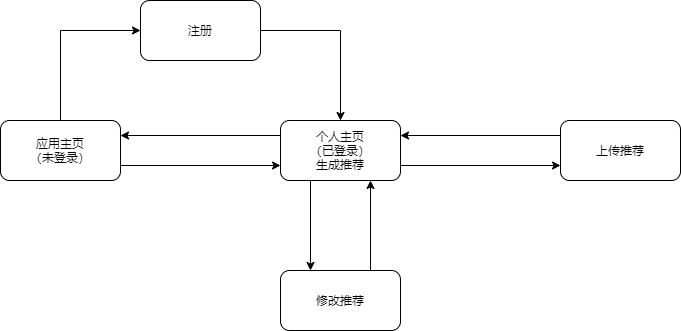

# 需求文档

## A.产品功能

​		实现一个外卖推荐系统，帮助用户解决在“早中晚”时点外卖的选择困难症。本项目将实现用户注册，用户登录，管理推荐，浏览推荐四个主要功能。用户注册和登录部分是为了让用户更好地管理自己上传的推荐；上传推荐中，用户可以分享一些图片，并加以文字描述；浏览推荐中，用户可以浏览所有的推荐，并进行筛选，排序，也能得到系统为他或她生成的的推荐。

## B.功能点流程

### 注册、登录和登出

#### **登录**

1、用户输入用户名（或邮箱账号），密码，点击“登录”按钮通过ajax传一个POST请求到后端；

2、后端验证用户名和密码是否匹配，返回一个状态响应，并修改cookie；

3、前端根据响应，成功则跳转页面，失败则提示重新输入。

#### **注册**

1、点击“注册”按钮进入注册界面；

2、注册界面输入一个邮箱地址，ajax传到后端，后端发送带有<u>网页链接</u>的邮件，网页链接在一定时间内有效；

3、用户通过点击链接，进入个人信息（基本信息是账号和密码）填写界面；

4、点击“提交”，通过*规范性检验*后注册成功，跳转到个人主页，否则提示出错的内容。

#### **登出**

1、在个人主页中点击“登出”按钮，前端发送POST请求到后端，修改cookie为无用户状态；

2、返回应用主页。

### 管理推荐

#### **上传推荐**

1、用户通过个人主页的“上传推荐”按钮，进入界面，要求用户先登录；

2、用户填写<u>文本编辑框</u>，并上传至多9张图片，通过前端的*规范性检验*后通过ajax传到后端，检验失败则提示用户相应原因；

3、后端进行*格式修饰*，保存到数据库中，给每个推荐都赋值一个id，并返回响应；

4、提示用户上传成功，并返回主页。

#### **显示推荐**

##### 显示自己的推荐

1、在登录完成后，后端渲染一个"个人主页"返回到前端，里面包含缩略的推荐；

2、点击进入某个推荐时，后端根据某个推荐的id，渲染出页面返回给前端。

##### 显示最热推荐

#### **修改推荐**

#### **删除推荐**

## C.分工

赵文轩（前端）：页面设计，逻辑设计

朱家信（连接前、后端）：发送请求，接收响应

金辰哲（后端）：接收请求，处理请求，发送响应，数据库设计

## D.流程图

