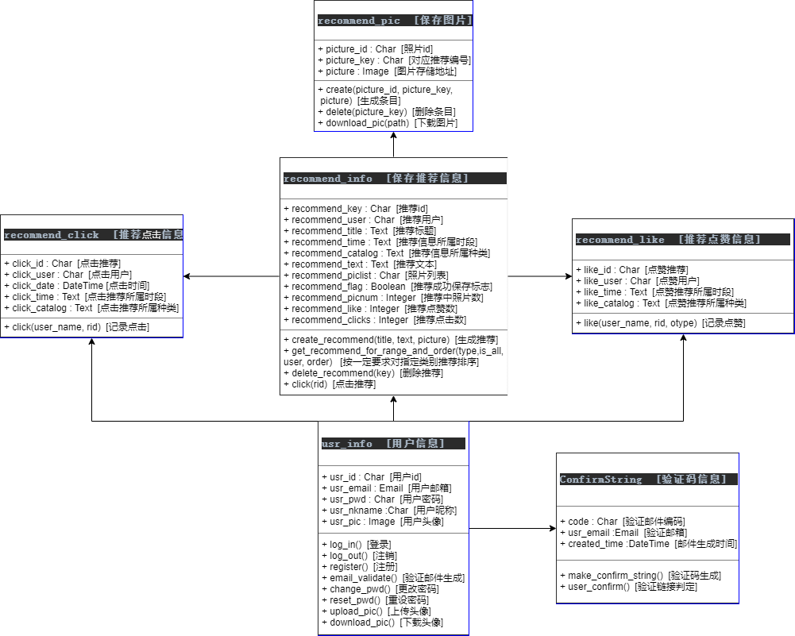

# 3  架构设计及结果

【描绘系统架构设计方案（例如前后端架构），必要时辅以文字说明】

推荐系统的后端采用Django架构，借助Django自带的sqlite数据库完成相关功能，并通过一系列数据库调用操作对数据库进行读写调度。

Django采用MVC框架，其中M为各个app部分的model.py代码中包含的数据模型，V为视图函数和html文件，C为控制urls文件内容、url分发与视图函数逻辑的控制器。

# 4  详细设计及结果（后端）

【列举代码级详细设计方案（包括最核心的实现层面的类图、活动图等），必要时辅以文字说明】

后端代码分为登录模块和推荐模块。

## 4.1 所用类介绍



登录模块使用了usr_info和ComfirmString类，分别用于记录各个登录用户的具体信息，和邮箱验证的验证码发放与记录。

推荐模块以recommend_info类为中心，记录了推荐的所有基本信息，包括推荐编号、推荐用户名、推荐标题、推荐内容、推荐图片记录表、推荐分类信息、推荐保存标志、推荐点赞数和点击数等信息。我们又创建了recommend_pic专门用于处理图片信息，recommend_like和recommend_click用于记录每一条点赞、点击记录。

## 4.2 后端接口介绍

### 请求地址

Sprint1阶段请求后端支持的访问地址为http://localhost:8000 。

### 前后端交互数据类型

后端实现用render跳转页面，增删查改数据库信息等功能。前端与后端通过约定格式的http/json信息交互，传递包括用户名、密码、图片、文字等信息。

后端实现cookie保存访问状态信息，记录包括用户登录状态、登录名、是否正在编辑推荐、上传的图片名等信息。

### 四类特殊返回值

为了防止重复描述，现介绍四种特殊类型返回情况，在对应接口的对应情况中出现：

**用户已登录：**`reason='Already login.'`

**接口不为POST请求：**`reason='Request method is not POST.'`

**未登录或已注销：**`reason='Already logout.'`

**未创建空推荐表：**`reason='Not recommended.'`

## 4.3 登录模块后端接口

### [1] login/log_in

#### 接口信息

接口为POST请求，要求用户尚未登录或已经注销账号（即cookie中无登录信息）。

对应函数为：`login_module.views.log_in`

#### 功能描述

实现前端界面登录功能，验证输入的用户名/邮箱与密码是否匹配。

#### 接口参数说明

**usr：**用户输入的用户名，字符格式。

**pwd：**用户输入的密码，字符格式。

#### 返回值说明

**状态正常：**

```
HTTP Response:
{
    'status': 'ok',
    'type': 'login', {'usr': user.usr_id},
}

cookie:
request.session['is_login'] = True
request.session['user_id'] = user.id
request.session['user_name'] = user.usr_id
```

**状态不正常：**

```
HTTP Response:
{
    'status': 'error',
    'type': reason,
}
```

#### 非平凡的状态不正常返回原因

**邮箱不存在：**`reason='Email not exist.'`

**用户不存在：**`reason='Username not exist.'`

**密码错误：**`reason='Wrong password.'`

### [2] login/log_out

#### 接口信息

接口为POST请求，要求用户已登录（即cookie中有登录信息）。

对应函数为：`login_module.views.log_out`

#### 功能描述

实现前端界面注销登录功能。

#### 接口参数说明

无。

#### 返回值说明

**状态正常：**

```
HTTP Response:
{
    'status': 'ok',
    'type': 'log_out',
}

cookie:
request.session 清空
```

**状态不正常：**

```
HTTP Response:
{
    'status': 'error',
    'type': reason,
}
```

### [3] login/register

#### 接口信息

接口为POST请求，要求用户尚未登录或已经注销账号（即cookie中无登录信息）。

对应函数为：`login_module.views.register`

#### 功能描述

实现前端界面注册功能，验证输入的用户名/邮箱与密码是否匹配。

保存用户信息到usr_info数据表。

#### 接口参数说明

**usr：**用户输入的用户名，字符格式，长度小于20字符，且不与其他用户名重复。

**pwd：**用户输入的密码，字符格式。

**email：**用户输入的邮箱，字符格式，且不与已经注册邮箱重复。

#### 返回值说明

**状态正常：**

```
HTTP Response:
{
    'status': 'ok',
    'type': 'register',
}
```

**状态不正常：**

```
HTTP Response:
{
    'status': 'error',
    'type': reason,
}
```

#### 非平凡的状态不正常返回原因

**邮箱名格式错误：**`reason='Invalid Email Address.'`

**邮箱已存在：**`reason='Email not exist.'`

**用户名过长：**`reason='Invalid Username.'`

**用户名已存在：**`reason='Username already exist.'`

### [4] login/email_validate

#### 接口信息

接口为POST请求，要求用户尚未登录或已经注销账号（即cookie中无登录信息）。

对应函数为：`login_module.views.email_validate`

#### 功能描述

实现前端界面邮箱验证功能，发送包含验证连接的邮件。

保存验证码信息到ConfirmString数据表。


#### 接口参数说明

**email：**用户输入的邮箱，字符格式。

#### 返回值说明

**状态正常：**

```
HTTP Response:
{
    'status': 'ok',
    'type': 'email_validate', {'code': confirm_code},
}
```

**状态不正常：**

```
HTTP Response:
{
    'status': 'error',
    'type': reason,
}
```

#### 非平凡的状态不正常返回原因

**邮箱名格式错误：**`reason='Invalid Email Address.'`

**邮箱已注册过：**`reason='Email Address exists.'`

**验证邮件未过期：**`reason='Validation Email not outdated.'`

### [5] login/change_pwd

#### 接口信息

接口为POST请求，要求用户已登录（即cookie中有登录信息）。

对应函数为：`login_module.views.change_pwd`

#### 功能描述

实现前端界面修改密码功能，验证输入旧密码是否正确，新密码与旧密码是否不同。

#### 接口参数说明

**old_pwd：**用户输入的旧密码，字符格式。

**new_pwd：**用户输入的新密码，字符格式。

#### 返回值说明

**状态正常：**

```
HTTP Response:
{
    'status': 'ok',
    'type': 'change_pwd',
}
```

**状态不正常：**

```
HTTP Response:
{
    'status': 'error',
    'type': reason,
}
```

#### 非平凡的状态不正常返回原因

**新/旧密码为空：**`reason='Invalid old/new password.'`

**旧密码输入错误：**`reason='Wrong old password.'`

**新密码与旧密码相同：**`reason='New password cannot be the same with old password.'`

### [6] login/reset_pwd

#### 接口信息

接口为POST请求，要求用户尚未登录或已经注销账号（即cookie中无登录信息）。

对应函数为：`login_module.views.reset_pwd`

#### 功能描述

实现前端界面重设密码功能，验证输入用户名与邮箱是否配对，发送系统随机生成的密码字符串到邮箱。

usr_info数据表中密码修改为新的密码。

#### 接口参数说明

**usr：**用户输入的用户名，字符格式。

**email：**用户输入的密码，字符格式。


#### 返回值说明

**状态正常：**

```
HTTP Response:
{
    'status': 'ok',
    'type': 'reset_pwd',
}
```

**状态不正常：**

```
HTTP Response:
{
    'status': 'error',
    'type': reason,
}
```

#### 非平凡的状态不正常返回原因

**用户不存在：**`reason='Username not exist.'`

**邮箱与用户名不匹配：**`reason='Invalid Email Address.'`

### [7] login/confirm

#### 接口信息

接口为GET请求，要求用户点击邮箱中的验证链接。

对应函数为：`login_module.views.user_confirm`

#### 功能描述

实现前端界面邮箱验证功能，用户点击邮件中的链接，确认。

#### 接口参数说明

无。

#### 返回值说明

页面跳转，无返回值。

## 4.4 推荐模块后端接口

### [1] recommend/create_recommend

#### 接口信息

接口为POST请求，要求用户已登录（即cookie中有登录信息）。

对应函数为：`login_module.views.create_recommend`

#### 功能描述

实现前端界面创建新推荐。

```
recommend_pic.objects.create(picture_id=pic_file.name, 
							 picture_key=key, 
							 picture=pic_file)
```

数据表recommend_pic中创建新条目，key为图片对应的推荐的序号，picture为图片文件。

```
recommend_info.objects.create(recommend_key=key, 
							  recommend_title=title,
                              recommend_user=request.session['user_name'],
                              recommend_picnum=pic_num,
                              recommend_time=timeRange, 
                              recommend_catalog=catalog,
                              recommend_text=text, 
                              recommend_piclist=json.dumps(newdict))
```

数据表recommend_info中创建新条目，key为当前时间，pic_num为上传的图片数目，newdict为图片信息列表。

#### 接口参数说明

**title：**推荐标题，text格式。

**text：**推荐文字，text格式。

**picture：**推荐的图片，FILE格式。

**timeRange：**推荐的时间段，字符格式。

**catalog：**推荐食物的类别，字符格式。

#### 返回值说明

**状态正常：**

```
HTTP Response:
{
    'status': 'ok',
    'type': 'create_recommend', {'key': key},
}
```

**状态不正常：**

```
HTTP Response:
{
    'status': 'error',
    'type': reason,
}
```

### [2] recommend/input_recommend

#### 接口信息

接口为POST请求，要求用户已登录（即cookie中有登录信息）。

对应函数为：`login_module.views.input_recommend`

#### 功能描述

以（管理员）用户的名义将大批推荐信息和点赞、点击信息写入数据库。

```
recommend_pic.objects.create(picture_id=value.name, 
							 picture_key=key, 
							 picture=value)
```

数据表recommend_pic中创建新条目，key为图片对应的推荐的序号，value为图片文件。

```
recommend_info.objects.create(recommend_key=key, 
							  recommend_title=title,
							  recommend_user=request.session['user_name'],
							  recommend_picnum=len(pic_dict),
							  recommend_time=timeRange, 
							  recommend_catalog=catalog,
							  recommend_like=like, 
							  recommend_clicks=clicks,
							  recommend_text=text, 
							  recommend_piclist=json.dumps(newdict))
```

数据表recommend_info中创建新条目，key为当前时间，pic_dict为图片信息列表。

```
recommend_like.objects.create(like_id=key, 
							  like_user=request.session['user_name'],
							  like_time=timeRange, 
							  like_catalog=catalog)
```

数据表recommend_like中创建新条目，key为对应的推荐的序号。

```
recommend_click.objects.create(click_id=key, 
							   click_user=request.session['user_name'],
                               click_time=timeRange, 
                               click_catalog=catalog)
```

数据表recommend_click中创建新条目，key为对应的推荐的序号。

#### 接口参数说明

**title：**推荐标题，text格式。

**text：**推荐文字，text格式。

**picture_dict：**推荐的图片，FILE格式。

**timeRange：**推荐的时间段，字符格式。

**catalog：**推荐食物的类别，字符格式。

**like：**点赞数，字符格式。

**clicks：**点击数，字符格式。

**testflag：**是否写入点赞数据库和点击数据库标志，为“1”则写入。

#### 返回值说明

**状态正常：**

```
HTTP Response:
{
    'status': 'ok',
    'type': 'input_recommend', {'key': key},
}
```

**状态不正常：**

```
HTTP Response:
{
    'status': 'error',
    'type': reason,
}
```

### [3] recommend/delete_recommend

#### 接口信息

接口为POST请求，要求用户已登录（即cookie中有登录信息）。

对应函数为：`login_module.views.delete_recommend`

#### 功能描述

实现前端界面删除推荐功能。

```
recommend_pic.objects.get(picture_id=pic_name).delete()
recommend_atom.delete()
```

删除推荐对应图片以及recommend_info中的条目。

#### 接口参数说明

**key：**推荐对应的编号，字符格式。

#### 返回值说明

**状态正常：**

```
HTTP Response:
{
    'status': 'ok',
    'type': 'delete_recommend',
}
```

**状态不正常：**

```
HTTP Response:
{
    'status': 'error',
    'type': reason,
}
```

#### 非平凡的状态不正常返回原因

**推荐key错误：**`reason='recommend_info not exist.'`

**删除的推荐不是当前用户创建：**`reason='Invalid Operation!'`

### [4] recommend/get_recommend

#### 接口信息

接口为GET请求。

#### 功能描述

实现前端界面获取推荐id对应的推荐信息。

对应函数为：`login_module.views.get_recommend`

#### 接口参数说明

 **id：**推荐对应的编号，字符格式。

#### 返回值说明

**状态正常：**

```
HTTP Response:
{
    'status': 'ok',
    'type': 'get_recommend', ret_dict,
}

其中：
ret_dict = {'text': recommend_atom.recommend_text,
            'title': recommend_atom.recommend_title,
            'piclist': recommend_atom.recommend_piclist,
            'picnum': recommend_atom.recommend_picnum,
            'user': recommend_atom.recommend_user,
            'like': recommend_atom.recommend_like,
            'rid': id,
            "timeRange": recommend_atom.recommend_time,
            "catalog": recommend_atom.recommend_catalog,
            }
```

**状态不正常：**

```
HTTP Response:
{
    'status': 'error',
    'type': reason,
}
```

#### 非平凡的状态不正常返回原因

**无id对应的推荐：**`reason='recommend not exist.'`

### [5] recommend/user_recommend

#### 接口信息

接口为POST请求。

对应函数为：`login_module.views.user_recommend`

#### 功能描述

实现前端界面获取当前用户所有推荐信息。

#### 接口参数说明

**username：**用户输入的用户名，字符格式。

#### 返回值说明

**状态正常：**

```
HTTP Response:
{
    'status': 'ok',
    'type': 'user_recommend', ret_dict,
}

其中：
key = recommend_atom.recommend_key
now_dict['user'] = recommend_atom.recommend_user
now_dict['title'] = recommend_atom.recommend_title
now_dict['text'] = recommend_atom.recommend_text
now_dict['piclist'] = recommend_atom.recommend_piclist
now_dict['like'] = recommend_atom.recommend_like
now_dict['picnum'] = recommend_atom.recommend_picnum
now_dict['rid'] = key
now_dict['timeRange'] = recommend_atom.recommend_time
now_dict['catalog'] = recommend_atom.recommend_catalog
ret_dict[key] = now_dict
```

**状态不正常：**

```
HTTP Response:
{
    'status': 'error',
    'type': reason,
}
```

#### 非平凡的状态不正常返回原因

**用户无上传的推荐：**`reason='recommends not exist.'`

### [6] recommend/get_liked_recommend

#### 接口信息

接口为POST请求，要求用户已登录（即cookie中有登录信息）。

对应函数为：`login_module.views.get_liked_recommend`

#### 功能描述

实现前端界面获取当前用户所有点赞的推荐信息。

#### 接口参数说明

无。

#### 返回值说明

**状态正常：**

```
HTTP Response:
{
    'status': 'ok',
    'type': 'like_recommend', ret_dict,
}

其中ret_dict与user_recommend相同
```

**状态不正常：**

```
HTTP Response:
{
    'status': 'error',
    'type': reason,
}
```

### [7] recommend/all_recommend

#### 接口信息

对应函数为：`login_module.views.all_recommend`

#### 功能描述

实现前端界面获取所有用户所有推荐信息。

#### 接口参数说明

无。

#### 返回值说明

**状态正常：**

```
HTTP Response:
{
    'status': 'ok',
    'type': all_recommend', ret_dict,
}

其中ret_dict与user_recommend相同
```

**状态不正常：**

```
HTTP Response:
{
    'status': 'error',
    'type': reason,
}
```

#### 非平凡的状态不正常返回原因

**无上传的推荐：**`reason='recommends not exist.'`

### [8] recommend/like

#### 接口信息

接口为GET请求，要求用户已登录（即cookie中有登录信息）。

对应函数为：`login_module.views.like`

#### 功能描述

记录点赞/取消点赞信息。

#### 接口参数说明

**rid：**点赞/取消点赞的推荐编号，字符格式。

**otype：**点赞"like"/取消点赞"cancel"，字符格式。

#### 返回值说明

**状态正常：**

```
HTTP Response:
{
    'status': 'ok',
    'type': 'like', {"likes": recommend_atom.recommend_like},
}

其中recommend_atom.recommend_like为修改后的推荐的点赞数。
```

**状态不正常：**

```
HTTP Response:
{
    'status': 'error',
    'type': reason,
}
```

### [9] recommend/check_like

#### 接口信息

接口为GET请求，要求用户已登录（即cookie中有登录信息）。

对应函数为：`login_module.views.check_like`

#### 功能描述

确认用户是否对当前推荐点赞。

#### 接口参数说明

**id：**当前推荐的编号，字符格式。

#### 返回值说明

**状态正常：**

```
HTTP Response:
{
    'status': 'ok',
    'type': 'like', {'result' : result},
}
其中result为'YES'/'NO'代表用户已点赞/未点赞。
```

**状态不正常：**

```
HTTP Response:
{
    'status': 'error',
    'type': reason,
}
```

### [10] recommend/click

#### 接口信息

接口为GET请求，要求用户已登录（即cookie中有登录信息）。

对应函数为：`login_module.views.like`

#### 功能描述

记录点赞/取消点赞信息。

#### 接口参数说明

**rid：**点赞/取消点赞的推荐编号，字符格式。

**otype：**点赞"like"/取消点赞"cancel"，字符格式。

#### 返回值说明

**状态正常：**

```
HTTP Response:
{
    'status': 'ok',
    'type': 'like', {"likes": recommend_atom.recommend_like},
}

其中recommend_atom.recommend_like为修改后的推荐的点赞数。
```

**状态不正常：**

```
HTTP Response:
{
    'status': 'error',
    'type': reason,
}
```

### [11] recommend/type_recommend

#### 接口信息

接口为POST请求。

对应函数为：`login_module.views.get_recommend_for_type`

#### 功能描述

实现前端界面获取推荐算法处理后的信息。如果用户已经登录，则可根据用户的选择和浏览记录，选出用户更偏好的推荐顺序。如果用户未登录，则按照用户点赞情况，推荐当前时间段的美食。

#### 接口参数说明

**type：**推荐类别（时间段或种类），字符格式。

**clock：**当前时间段，字符格式。

**downbound：**推荐列表的读取下界，字符格式。

**upbound：**推荐列表的读取上界，字符格式。

**refresh：**刷新标示，为1则刷新。

#### 返回值说明

**状态正常：**

```
HTTP Response:
{
    'status': 'ok',
    'type': 'get_recommend', ret_dict,
}

其中ret_dict与user_recommend相同
```

**状态不正常：**

```
HTTP Response:
{
    'status': 'error',
    'type': reason,
}
```

