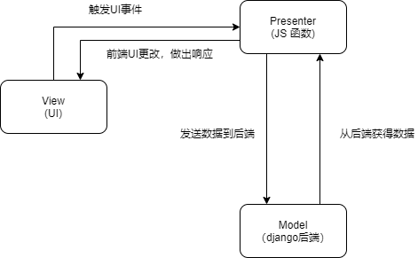
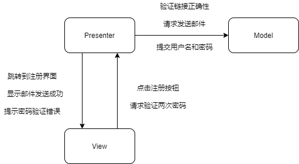
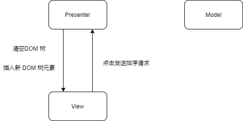
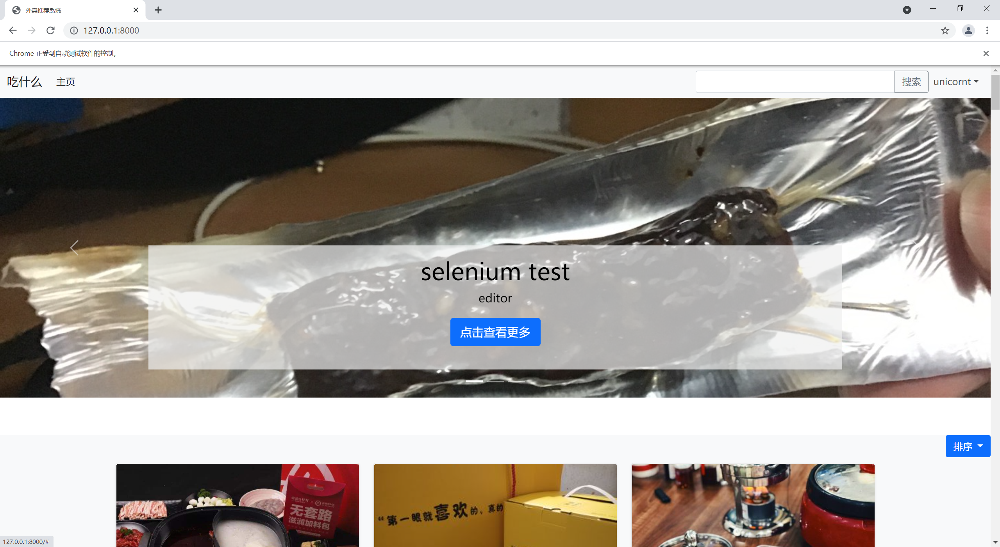
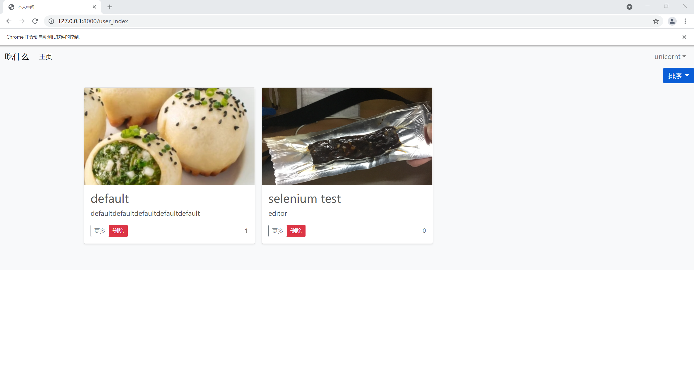
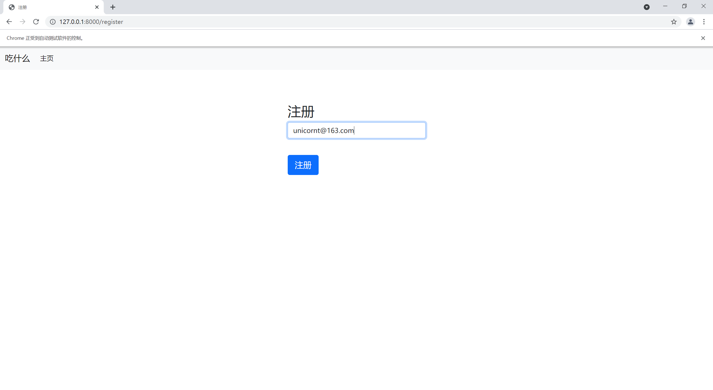
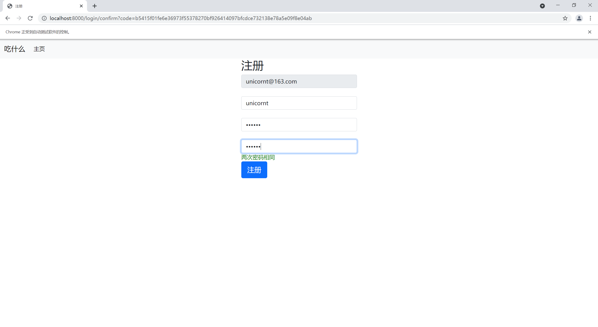
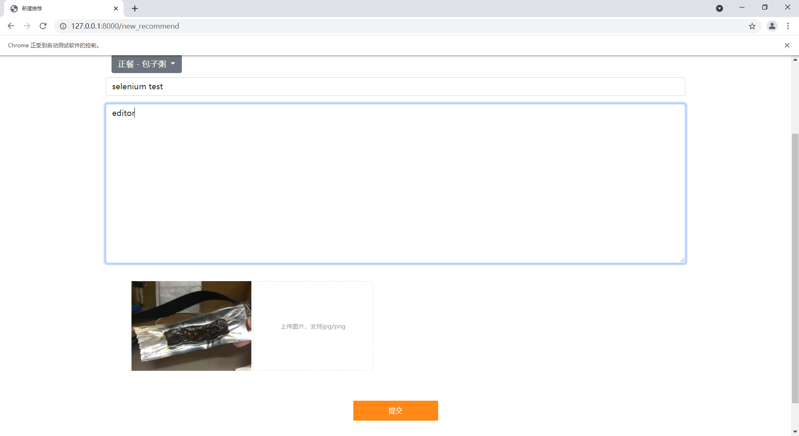

前端架构为 MVP，UI 和 UI 事件属于 View，JS 文件中负责处理 UI 事件并向后端请求数据的函数属于 Presenter，后端属于 Model。前端 UI 访问后端必须通过 JS 文件中的函数进行。



## 登录

登录的检测和按钮的展示集成在 index.js，cookie.js，login.js 中。其中 index.js 提供了添加用户菜单或登录按钮的功能，login.js 提供了登录与后端交互的函数，cookie.js 提供了通过 cookie 检查用户是否已经登录的功能。


```js
// index.js 添加用户菜单或登录按钮
var userName = getCookie("username");
    console.log(userName);
    var doc = '';
    if (userName != "") {
        console.log(userName);
        doc += '<ul class="navbar-nav navbar-right">' +
            '<li class="nav-item dropdown">\n' +
            '<a class="nav-link dropdown-toggle" href="#" id="navbarDropdown" role="button" data-bs-toggle="dropdown" aria-expanded="true" >\n' +
            userName +
            '</a>\n' +
            '        <div class="dropdown-menu dropdown-menu-end" aria-labelledby="navbarDropdown">\n' +
            '          <a class="dropdown-item" href="/new_recommend">提交测评</a>\n' +
            '          <a class="dropdown-item" href="/user_index">个人主页</a>\n' +
            '          <a class="dropdown-item" href="/like_index">我的赞</a>\n' +
            '          <div class="dropdown-divider"></div>\n' +
            '          <a class="dropdown-item" onclick="Logout()">登出</a>\n' +
            '        </div>\n' +
            '      </li>' +
            '</ul>';
    } else {
        doc += '<ul class="nav navbar-nav navbar-right">\n' +
            '<li class="nav-item">' +
                '<a class="nav-link" href="login" id="login-button">登录</a></li>\n' +
            '</ul>';
    }
    $("#navbarSupportedContent").append(doc);
```

```js
// login.js 与后端交互
function checkLogin() {
    var usr = $("#usr").val()
    console.log(usr);
    $.ajax({
        url:"/login/log_in",
        type:"POST",
        data: {
            usr:$("#usr").val(),
            pwd:$("#pwd").val()
        },
        dataType: "json",
        complete:function(data){
            console.log("complete");
        },
        success:function(data){
            console.log("success");
            if(data.status == 'ok') {
                document.cookie='username='+$("#usr").val();
                window.location.href='/';
            }
            else if(data.status == 'error'){
                console.log('error');
                $('#badlogin').css({'visibility': 'visible'});
            }
        },
        error:function(e){
            console.log("error");
        }
    });
}
```

```js
// cookie.js 检测用户是否已经登录
function getCookie(cname)
{
    var name = cname + "=";
    var ca = document.cookie.split(';');
    for(var i=0; i<ca.length; i++)
    {
        var c = ca[i].trim();
        if (c.indexOf(name)==0) return c.substring(name.length,c.length);
    }
    return "";
}
```

## 注册

点击注册按钮并跳转到邮箱输入界面后，输入邮箱点击注册后，前端会调用 checkRegister() 函数，与后端进行交互。



```js
// register.js
function checkRegister() {
    $.ajax({
        url:"/login/email_validate",
        type:"POST",
        data: {
            email:$("#email").val()
        },
        dataType: "json",
        complete:function(data){
            console.log("complete");
        },
        success:function(data){
            console.log("success");
            if(data.status == 'ok') {
                window.location.href='/email_sent';
            }
            else if(data.status == 'error'){
                // 显示错误信息
                $("#badregister").text(data.type);
                $("#badregister").css({'visibility': 'visible'});
                console.log('error');
            }
        },
        error:function(e){
            console.log("error");
        }
    });
}
```

如果发送确认邮件成功，会跳转到提示成功界面，否则跳转到对应的错误提示界面。

打开确认邮件中的地址后，进入到完善注册信息的界面。

```html
<div class="container">
    <form class="form-signin">
        <h2 class="form-sigin-heading">注册</h2>
        <input type="text" class="form-control" name="email" id="email" value={{email}} readonly="readonly"><br/>
        <input type="text" class="form-control" name="usr" id="usr" placeholder="用户名"/><br/>
        <input type="password" class="form-control" name="pwd" id="pwd" placeholder="密码"/><br/>
        <input type="password" class="form-control" name="pwd" id="pwd2" placeholder="再次输入密码" onkeyup="validate()"/><span id="messg"></span><br/>
        <input id="button" class="btn btn-lg btn-primary btn-block" type="button" value="注册" onclick="checkRegister()"/>
    </form>
</div>
```

其中 id 为 pwd2 的模块会检测两次密码是否相同，如果不同将会使确认按钮无效。

```js
// confirm.js
function validate() {
    var pwd = $("#pwd").val();
    var pwd1 = $("#pwd2").val();
    <!-- 对比两次输入的密码 -->
    if(pwd == pwd1)
    {
        $("#messg").html("两次密码相同");
        $("#messg").css("color","green");
    }
    else {
        $("#messg").html("两次密码不相同");
        $("#messg").css("color","red")
        $("button").attr("disabled","disabled");
    }
}
```

## 排序功能

排序功能的功能由前端直接完成，主要操作步骤为：对前端存储的推荐数据进行排序（mySort() 函数）；清除 DOM 树中推荐的部分；将推荐数据重新插入 DOM 树中（myRender() 函数）。



```js
// user_index.js
function cmp(a, b){
    aS = a.split('-')
    bS = b.split('-')
    for(var i=0; i < aS.length; i++) {
        if(parseInt(aS[i]) < parseInt(bS[i])){
            console.log('compare s', parseInt(aS[i]), parseInt(bS[i]));
            return 1
        }
        else if(parseInt(aS[i]) > parseInt(bS[i])){
            console.log('compare', parseInt(aS[i]), parseInt(bS[i]));
            return 0
        }
    }
    return 0
}

function mySort(type){
    var N = N_user;
    var list = list_user;
    var retdata = retdata_user;
    if(type == 0) {
        // sort with upload time
        console.log("sort with time");
        for(var i = 0; i < N; i++){
            for(var j = i + 1; j < N; j++){
                if(cmp(retdata[list[j]].rid, retdata[list[i]].rid)) {
                    console.log("exchange");
                    var tmp = list[i];
                    list[i] = list[j];
                    list[j] = tmp;
                }
            }
        }
    }
    else {
        console.log("sort with like");
        for(var i = 0; i < N; i++){
            for(var j = i + 1; j < N; j++){
                if(retdata[list[j]].like > retdata[list[i]].like) {
                    console.log("exchange");
                    var tmp = list[i];
                    list[i] = list[j];
                    list[j] = tmp;
                }
            }
        }
    }
    console.log("sort part finish");
    list_user = list;
    myRender();
}
function myRender(){
    $('#show_container').empty();
    var list = list_user;
    var N = N_user;
    var retdata = retdata_user;
    for(var i = 0; i < N; i++) {
        console.log(list[i], typeof(list[i]), retdata[list[i]]);
        var val = list[i];
        console.log(retdata[val].piclist);
        var num = 1
        var rown = 0
        var piclist = JSON.parse(retdata[val].piclist);
        var picsrc = piclist['1'];
        console.log(picsrc);
        if(num % 3 === 1) {
            rown += 1;
            $('#show_container').append('<div class="row row-cols-1 row-cols-sm-2 row-cols-md-3 g-3" id="show_row' + rown.toString() + '">\n' +
                '\n' +
                '</div>');
        }
        $('#show_row'+rown.toString()).append('<div class="col">\n' +
            '                    <div class="card shadow-sm">\n' +
            '                        \n' +
            '\n' +
            '                        <div class="card-body">\n' +
            '                            <h3 class="card-text">' + retdata[val].title + '</h3>\n' +
            '                            <p class="card-text limit-line">' + retdata[val].text + '</p>\n' +
            '                            <div class="d-flex justify-content-between align-items-center">\n' +
            '                                <div class="btn-group">\n' +
            '                                    <a href="/show_recommend?rid=' + retdata[val].rid + '"><button type="button" class="btn btn-sm btn-outline-secondary">更多</button></a>\n' +
            '                                    <button type="button" class="btn btn-sm btn-danger" onclick="delete_recommend(\'' + retdata[val].rid +'\')">删除</button>\n' +
            '                                </div>\n' +
            '                                <small class="text-muted" id="click_number">'+ retdata[val].like.toString() +'</small>\n' +
            '                            </div>\n' +
            '                        </div>\n' +
            '                    </div>\n' +
            '                </div>');
        num += 1;
    }
}
```

## 上传推荐中的图片添加

图片添加功能是从网上找到的模块，经过了一定的修改更加符合界面。


```html
<div class="upload-content" style="margin: 0rem;width: 100%">
        <div class="content-img">
            <ul class="content-img-list">
                <!-- <li class="content-img-list-item"><a class="delete-btn"><i class="ico-delete"></i></a></li> -->
            </ul>
            <div class="file">
                上传图片，支持jpg/png
                <input type="file" name="file" accept="image/*" id="upload" >
            </div>
        </div>
        <div class="upload-tips">

        </div>
        <div class="upload-submit">
            <a href="javascript:;" id="btn-submit-upload" class="btn-submit-upload">提交</a>
        </div>
    </div>
```

```js
// new_recommend.js 图片上传和提交模块
$(function(){
	// 鼠标经过显示删除按钮
	$('.content-img-list').on('mouseover','.content-img-list-item',function(){
		$(this).children('a').removeClass('hide');
	});
	// 鼠标离开隐藏删除按钮
	$('.content-img-list').on('mouseleave','.content-img-list-item',function(){
		$(this).children('a').addClass('hide');
	});
	// 单个图片删除
	$(".content-img-list").on("click",'.content-img-list-item a',function(){
	    	var index = $(this).attr("index");
			imgSrc.splice(index, 1);
			imgFile.splice(index, 1);
			imgName.splice(index, 1);
			var boxId = ".content-img-list";
			addNewContent(boxId);
			if(imgSrc.length<4){//显示上传按钮
				$('.content-img .file').show();
			}
	  });
	//图片上传
	$('#upload').on('change',function(){			
		
		if(imgSrc.length>=4){
			return alert("最多只能上传4张图片");
		}

		var imgBox = '.content-img-list';
		var fileList = this.files;
		for(var i = 0; i < fileList.length; i++) {
			var imgSrcI = getObjectURL(fileList[i]);
			imgName.push(fileList[i].name);
			imgSrc.push(imgSrcI);
			imgFile.push(fileList[i]);
		}
		if(imgSrc.length==4){//隐藏上传按钮
			$('.content-img .file').hide();
		}
		addNewContent(imgBox);
		this.value = null;//解决无法上传相同图片的问题
	})

	//提交请求
    //$('#title').val(), $('#editor').val(), 'pic_div', vm.$data.tag
    $('#btn-submit-upload').on('click',function(){
        // FormData上传图片
        var formData = new FormData();
        $.each(imgFile, function(i, file){
            formData.append('picture', file);
        });

        formData.append('title', $('#title').val());
        formData.append('text', $('#editor').val());
        tag = vm.$data.tag;
        tag = tag.toString();
        console.log(tag.split(" - "));
        formData.append('timeRange', tag.split(" - ")[0].toString());
        formData.append('catalog', tag.split(" - ")[1].toString());
        $.ajax({
            url: "recommend/new_recommend",
            type: "POST",
            dataType: "json",
            contentType: false,
            processData: false,
            async: false,
            data: formData,
            complete: function(data) {
                console.log(formData);
            },
            success: function (data) {
                // console.log("create recommend 1 success");
                // console.log(String(data.content.key));
                alert("提交成功");
                window.location.href='/user_index';
            },
            error: function (data) {
                console.log("error");
                alert("提交出现错误，请重新提交");
            }
        });
    });

});
```

```js
//删除
function removeImg(obj, index) {
	imgSrc.splice(index, 1);
	imgFile.splice(index, 1);
	imgName.splice(index, 1);
	var boxId = ".content-img-list";
	addNewContent(boxId);
}

//图片展示
function addNewContent(obj) {
	// console.log(imgSrc)
	$(obj).html("");
	for(var a = 0; a < imgSrc.length; a++) {
		var oldBox = $(obj).html();
		$(obj).html(oldBox + '<li class="content-img-list-item"><a index="'+a+'" class="hide delete-btn"><i class="ico-delete"></i></a></li>');
	}
}

//建立一个可存取到该文件的url
function getObjectURL(file) {
	var url = null ;
	if (window.createObjectURL!=undefined) { // basic
		url = window.createObjectURL(file) ;
	} else if (window.URL!=undefined) { // mozilla(firefox)
		url = window.URL.createObjectURL(file) ;
	} else if (window.webkitURL!=undefined) { // webkit or chrome
		url = window.webkitURL.createObjectURL(file) ;
	}
	return url ;
}
```

# 前端图片展示

主页



用户空间



注册邮箱输入



注册信息完善



上传推荐


