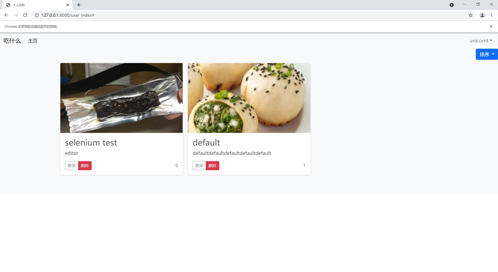
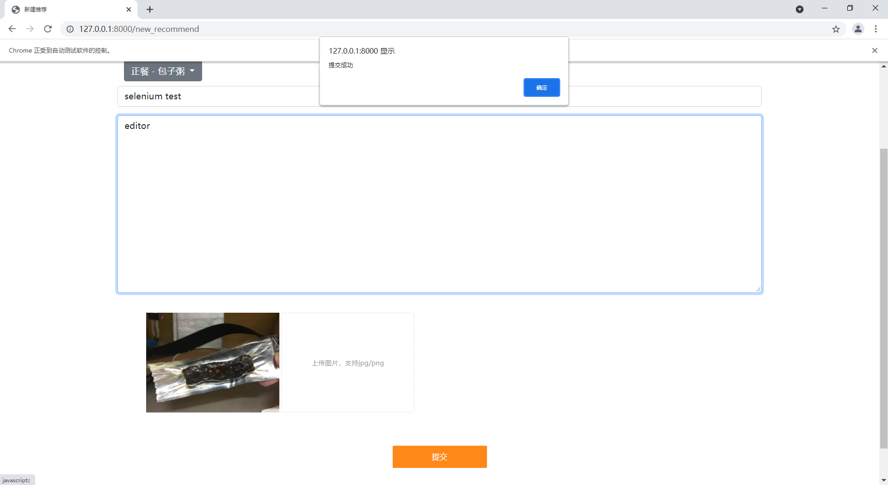

# 基于selenium 的前端测试说明

采用了 python3.8 + selenium3.141.0，chrome 和 chrome drive 版本为 91。

## 登录测试

登录测试是非常重要的一部分，也是后面很多测试的基础。

打开主页后，会最大化窗口保证 UI 显示正常。找到 id 为 login-button 的按钮，点击跳转到输入用户名和密码的登录界面。

根据 name 属性找到用户名和密码的输入框，输入用户名和密码，找到 id 为 login 的按钮，点击完成登录操作。

## 用户界面

首先完成登录操作。

在任务栏中找到 id 为 navbarDropdown 的下拉菜单展开按钮（即右上角的显示用户名的按钮），点击展开个人操作菜单。

找到 "个人空间" 按钮，点击跳转到个人空间。

接下来测试空间浏览的排序功能，点击排序后分别点击 “被赞数” 和 “上传时间” 可以看到不同的排序方式。上图为按被赞数排序，下图为按上传时间排序。

## 注册测试

在登录界面通过 "register" id 找到注册按钮，点击进入输入邮箱注册的界面。

通过 name 属性找到邮箱输入框并输入邮箱后，点击 id 为 “register-button” 的注册按钮，后端会发送注册邮件。

拿到注册邮件中的地址输入到程序中，程序会自动进行跳转。通过 name 和 id 属性找到输入框并输入用户名和密码之后，点击注册按钮完成注册。

## 上传测试

完成登录后，通过用户下拉菜单跳转到上传测评的界面。

通过选择标签按钮选取正餐 > 包子粥。在标题框和文本框中输入文本，通过图片选择框选择目标图片，最后点击按钮上传成功推荐。

## 搜索测试

登陆成功后，找到搜索框，输入文本并点击搜索按钮，可以看到成功出现了相关的推荐。

